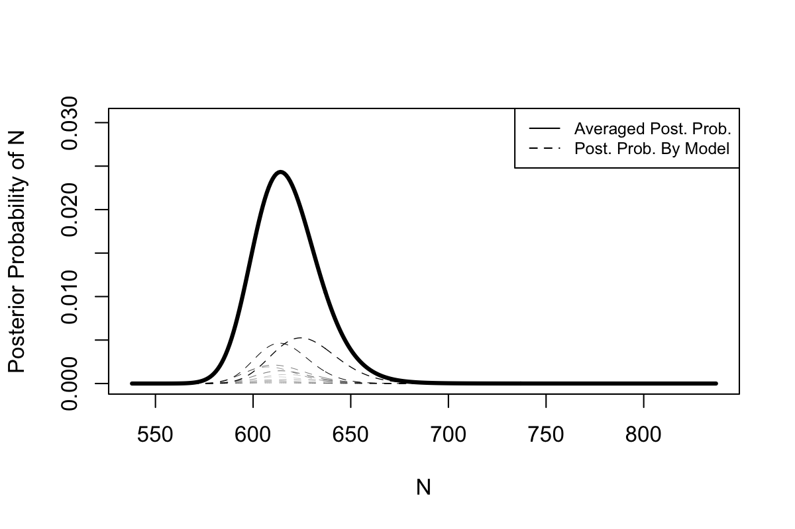

[](https://cran.r-project.org/package=dga)
  [](https://github.com/OlivierBinette/DGA/actions)

DGA
===

Performs capture-recapture estimation by averaging over decomposable graphical models. This implements the approach introduced in Madigan and York (1997).

## Installation
Stable CRAN release:
```r
install.packages("dga")
```

## Example usage

Five lists example from Madigan and York (1997):

```r
library(dga)

# Number of lists and prior hyperparameter
p <- 5
data(graphs5) # Decomposable graphical models on 5 lists.
delta <- 0.5
Nmissing <- 1:300 # Reasonable range for the number of unobserved individuals.

# Counts corresponding to list inclusion patterns.
Y <- c(0,27,37,19,4,4,1,1,97,22,37,25,2,1,3,5,83,36,34,18,3,5,0,2,30,5,23,8,0,3,0,2)
Y <- array(Y, dim=c(2,2,2,2,2))
N <- sum(Y) + Nmissing

# Model-wise posterior probaiblities on the total population size.
# weights[i,j] is the posterior probability for j missing individuals under model graphs5[[j]].
weights <- bma.cr(Y,  Nmissing, delta, graphs5)

# Plot of the posterior distribution.
plotPosteriorN(weights, N)
```

<center>
   
</center>

## References

- David Madigan and Jeremy C. York. "Bayesian methods for estimation of the size of a closed population." _Biometrika_. Vol. 84, No. 1 (Mar., 1997), pp. 19-31.
- Mauricio Sadinle (2018) Bayesian propagation of record linkage uncertainty into population size estimation of human rights violations. _Annals of Applied Statistics_ Vol. 12 No. 2  pp. 1013-1038


Written by James Johndrow, Kristian Lum, and Patrick Ball. 

copyright (c) 2015 Human Rights Data Analysis Group (HRDAG)
https://hrdag.org

